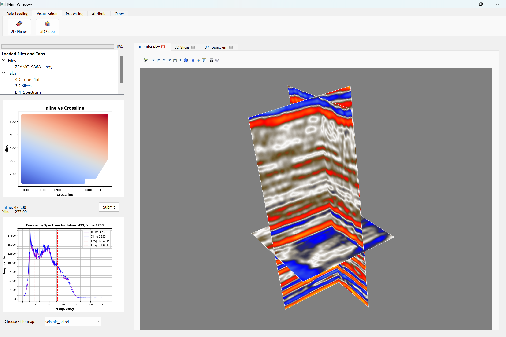
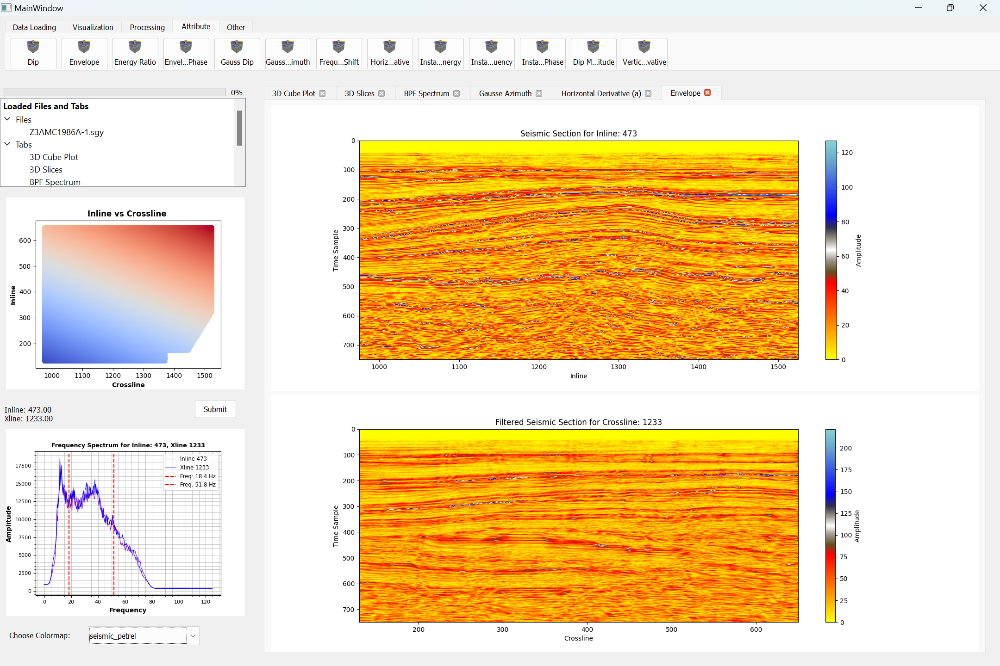
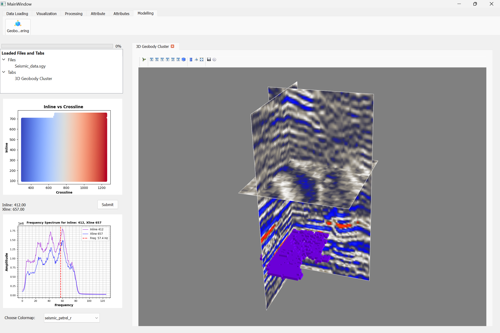

# Seismic-Attribute-Analysis-&-Geobody-Identification

Open-source tool for seismic visualization, attribute analysis, and geobody identification.

## Demo Videos

* **Seismic Interface Demo**
  https://drive.google.com/file/d/1WGs2JpDliIa0xBGgh51zoApUQ9V3wVmt/view?usp=drive_link

* **Petroharrit**
  https://drive.google.com/file/d/1tN19RVW3lC3WlKs2f9yEpChtxnSPaDoh/view?usp=sharing
